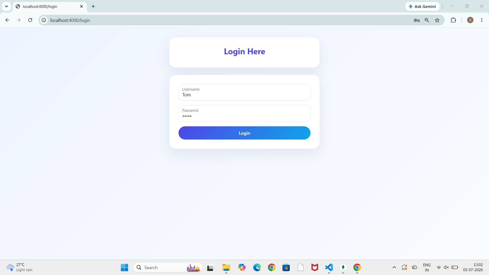
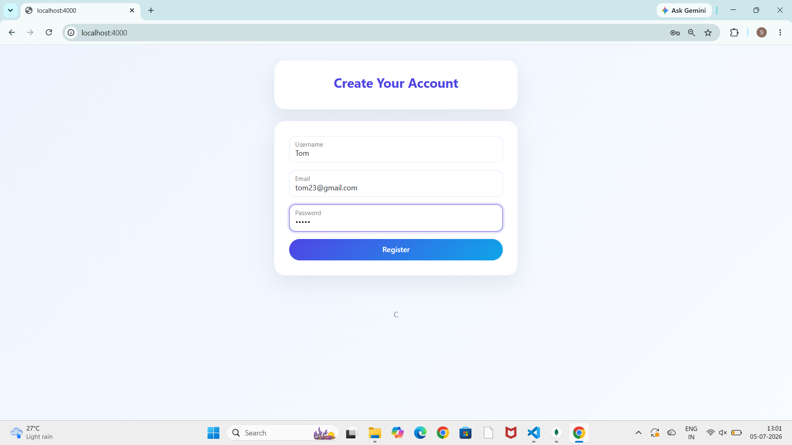
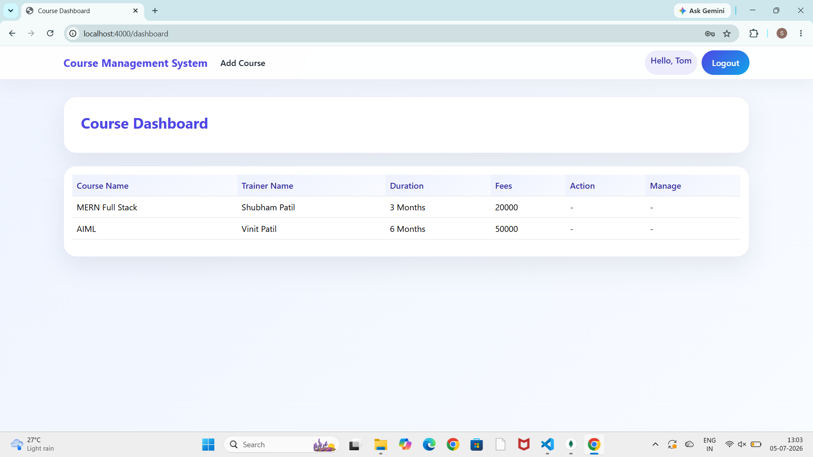
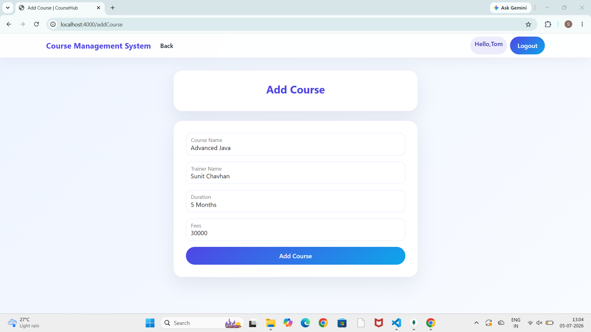
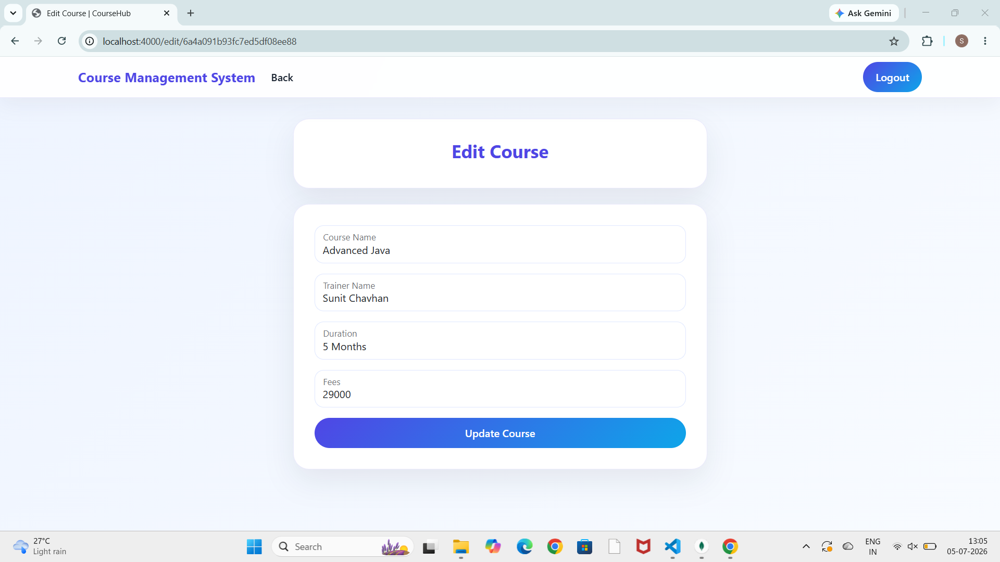
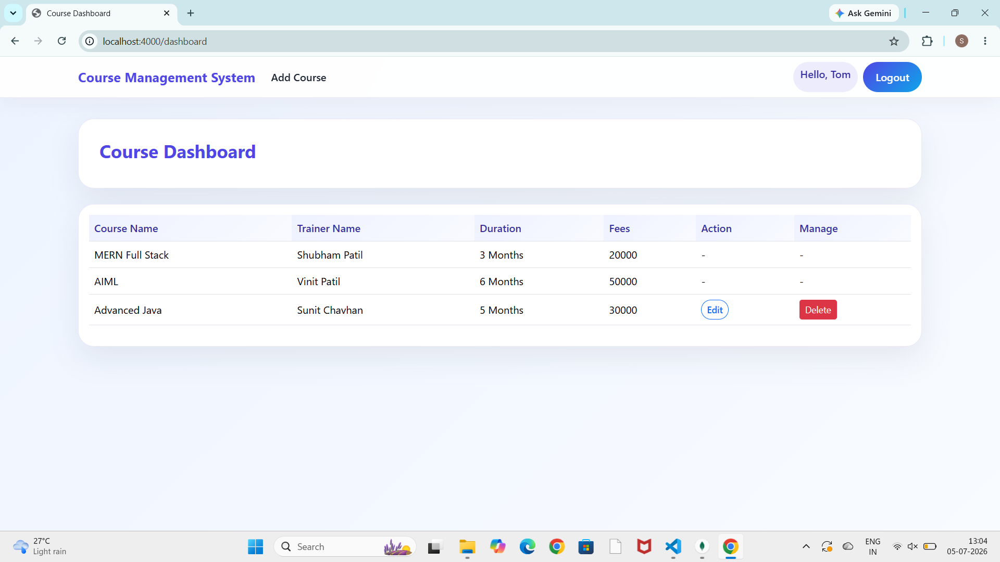
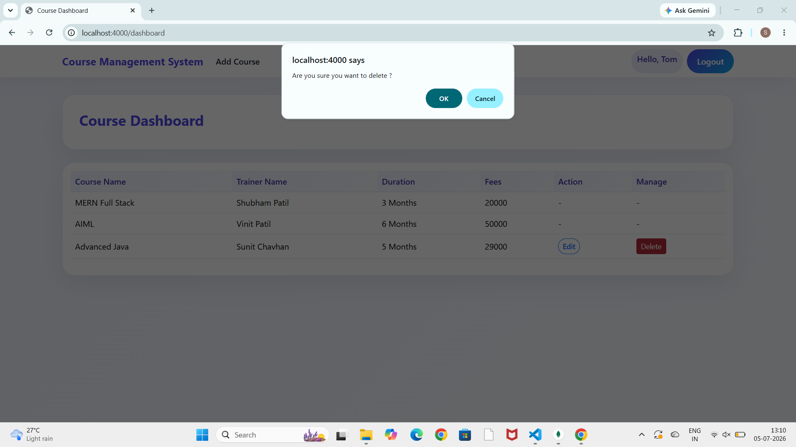
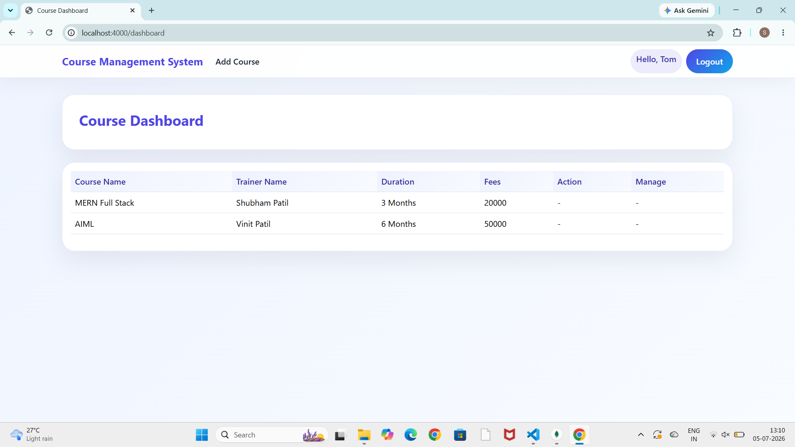
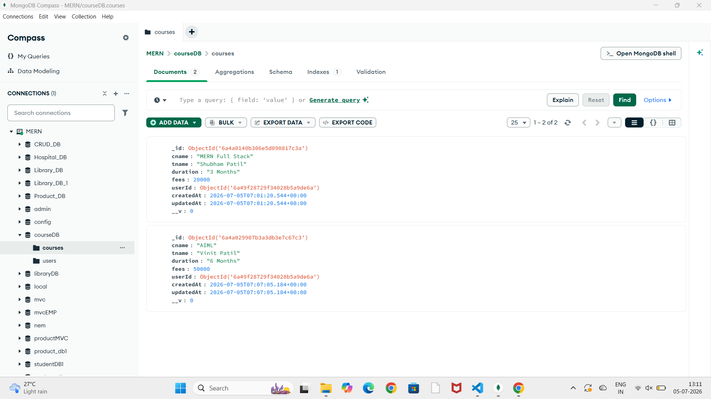
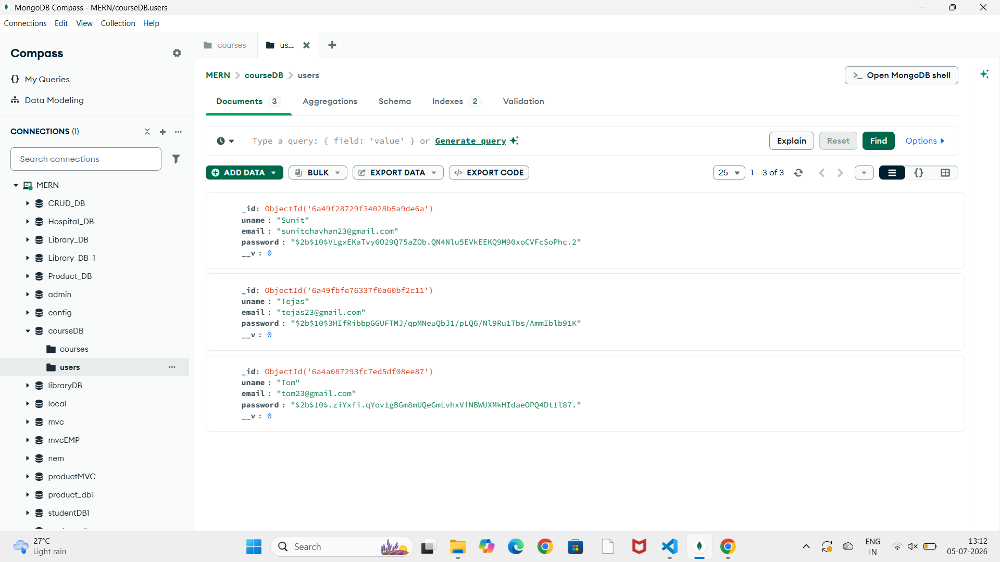

# Online Course Management System

## Project Title
Online Course Management System

## Objective
This project is a simple web application that allows users to register, log in, and manage online courses. It provides a basic dashboard for adding, viewing, editing, and deleting course information.

## Project Structure
```text
Online-Course-Management-System/
├── app.js
├── package.json
├── Config/
│   └── db.js
├── Controller/
│   └── courseController.js
│   └── userController.js
├── Model/
│   └── courseModel.js
│   └── userModel.js
├── Routes/
│   └── courseRoutes.js
│   └── userRoutes.js
├── public/
│   └── styles.css
│   └── Screenshots/
├── views/
│   └── add.ejs
│   └── dashboard.ejs
│   └── edit.ejs
│   └── login.ejs
│   └── register.ejs
```

## Technologies Used
- Node.js
- Express.js
- MongoDB
- Mongoose
- EJS
- Bootstrap
- CSS

## Project Features
- User registration and login
- Course dashboard to view available courses
- Add new courses
- Edit existing courses
- Delete courses
- Simple and responsive UI

## Installation Steps
1. Clone the repository
2. Navigate to the project folder
3. Install dependencies:
   ```bash
   npm install
   ```
4. Make sure MongoDB is running on your system
5. Configure the database connection in the project settings if needed

## How to Run the Project
Run the following command:

```bash
nodemon app.js
```

Then open your browser and visit:

```bash
http://localhost:4000
```

## Screenshots

### Login Page


### Register Page


### Dashboard


### Add Course Page


### Edit Course Page


### Course Display


### Before Delete


### After Delete


### MongoDB Course Data


### MongoDB User Data

